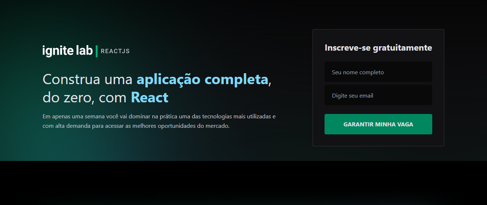
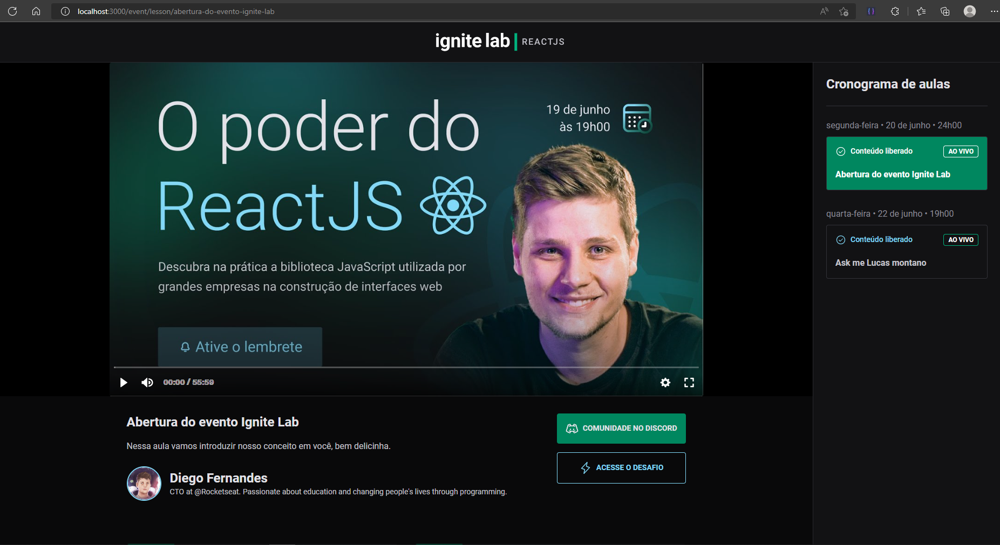

<h3 align="center">
    
    <br><br>
    <b>Ignite Lab é uma Plataforma de eventos</b>  
    <br>
</h3>


# Índice

- [Tecnologias Utilizadas](#tecnologias-utilizadas)
- [Conceitos Aprendido](#conceito-aprendido)
- [Como Usar](#como-usar)
- [Como Contribuir](#como-contribuir)


## Acesse aplicação: https://event-platform-rafael-rufino.vercel.app/

<a id="tecnologias-utilizadas"></a>

## :rocket: Tecnologias Utilizadas

O projeto foi desenvolvido utilizando as seguintes tecnologias

## Front End
- [React](")

- [Tailwind]("")

- [TypeScript]("")


## BACK END
- [Graphql]("")

- [Apollo Client]("")


<a id="#conceito-aprendido"></a>

## CONCEITO APRENDIDO
# - Graphql
# - GraphCMS - Oferece APIs instantâneas de conteúdo para graphql
# - Codegen - Gerar código a partir do seu esquema GraphQL


## :heavy_check_mark: :iphone: Versão Desktop 


<h1 align="center">
    
</h1>

<h1 align="center">
    
</h1>


<a id="como-usar"></a>

## :fire: Como usar


1. Faça um clone :

```sh
  $ git clone https://github.com/Rafael-Rufino/event-platform
```

2. Executando a Aplicação:

```sh
  # Instale as dependências
  $ npm install 
  ou 
  $ Yarn

  # Inicie a aplicação web
  $ cd event-platform
  $ yarn start
```

<a id="como-contribuir"></a>


# :recycle: Como contribuir

- Faça um Fork desse repositório,
- Crie uma branch com a sua feature: `git checkout -b my-feature`
- Commit suas mudanças: `git commit -m 'feat: My new feature'`
- Push a sua branch: `git push origin my-feature`


## :memo: License

Esse projeto está sob a licença MIT. Veja o arquivo [LICENSE](LICENSE.md) para mais detalhes.


<h4 align="center">
    Feito com 💜 by <a href="https://www.linkedin.com/in/rafael-r-dos-santos-b889311ba/" target="_blank">Rafael Rufino</a>
</h4>
